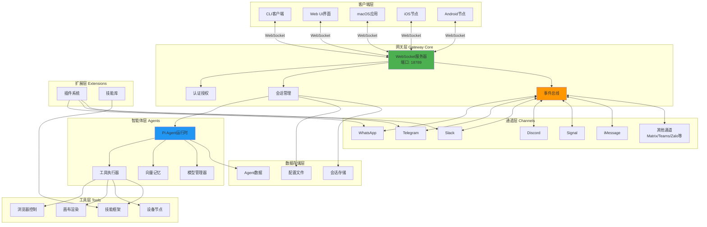
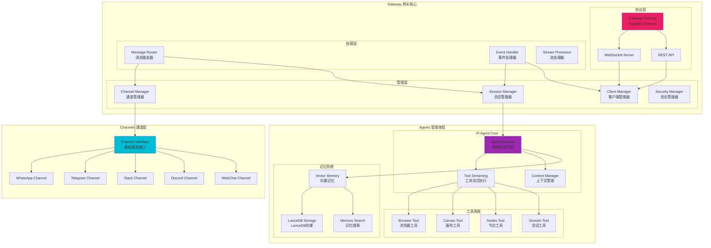

# Moltbot 系统架构图

## 一、整体分层架构

## 二、核心组件架构

## 三、目录结构说明

### 核心目录

- **src/** - 核心应用源代码（1,615个TypeScript文件）
  - **cli/** - 命令行接口实现
  - **gateway/** - WebSocket网关服务器
  - **agents/** - AI智能体运行时
  - **channels/** - 消息通道实现
  - **config/** - 配置系统
  - **plugins/** - 插件系统
  - **tools/** - 工具实现
  - **skills/** - 技能框架
  - **browser/** - 浏览器控制
  - **sessions/** - 会话管理
  - **security/** - 安全处理

- **extensions/** - 通道/功能扩展（30+个插件）
  - 各平台通道插件（WhatsApp, Telegram, Slack等）
  - 记忆扩展（memory-core, memory-lancedb）
  - 语音通话、诊断等扩展

- **ui/** - Web控制界面
  - 基于Lit的Web Components
  - Vite构建系统

- **apps/** - 原生应用
  - **macos/** - macOS菜单栏应用
  - **ios/** - iOS节点应用
  - **android/** - Android节点应用

- **skills/** - 智能体技能库
  - 各种集成技能（1Password, Notes, Calendar等）

- **docs/** - 文档站点
  - Mintlify文档系统

## 四、关键组件说明

### 1. Gateway 网关核心
- **WebSocket服务器**: 监听18789端口，处理所有客户端连接
- **协议实现**: 基于TypeBox的JSON Schema验证
- **会话管理**: 管理所有AI会话和状态
- **事件总线**: 广播事件到所有连接的客户端

### 2. Channels 通道系统
- **统一接口**: 所有通道实现相同的基础接口
- **路由管理**: 智能消息路由和允许列表管理
- **群组处理**: 支持@提及和群组消息过滤

### 3. Agents 智能体
- **Pi Agent核心**: 嵌入式智能体运行时
- **工具执行**: 50+内置工具支持
- **上下文管理**: 消息历史和记忆检索
- **模型支持**: 多提供商支持和故障转移

### 4. Plugins 插件系统
- **自动发现**: 扫描并加载扩展目录
- **清单验证**: 验证clawdbot.plugin.json
- **钩子系统**: 生命周期和事件钩子
- **依赖管理**: 自动处理插件依赖

### 5. Skills 技能框架
- **三种类型**: 捆绑、托管、工作区技能
- **工具定义**: SKILL.md描述和工具函数
- **环境注入**: 安全的环境变量注入
- **自动提示**: 智能技能发现和推荐

## 五、数据流向

### 客户端 → Gateway → Agent
1. 客户端通过WebSocket连接到Gateway
2. 发送命令（agent, send, channels.*等）
3. Gateway验证权限并路由到相应组件
4. Agent处理请求并流式返回结果
5. Gateway广播事件到所有订阅的客户端

### 通道 → Gateway → Agent → 通道
1. 用户在消息平台发送消息
2. 通道接收并转发到Gateway
3. Gateway路由到相应的Agent会话
4. Agent处理（可能调用工具）
5. 响应通过Gateway返回通道
6. 通道发送回复给用户

### Agent → Tools → 结果
1. Agent决定需要调用工具
2. Gateway验证工具权限
3. 工具执行器运行工具（本地或远程节点）
4. 结果流式返回给Agent
5. Agent继续处理（可能需要多次工具调用）
