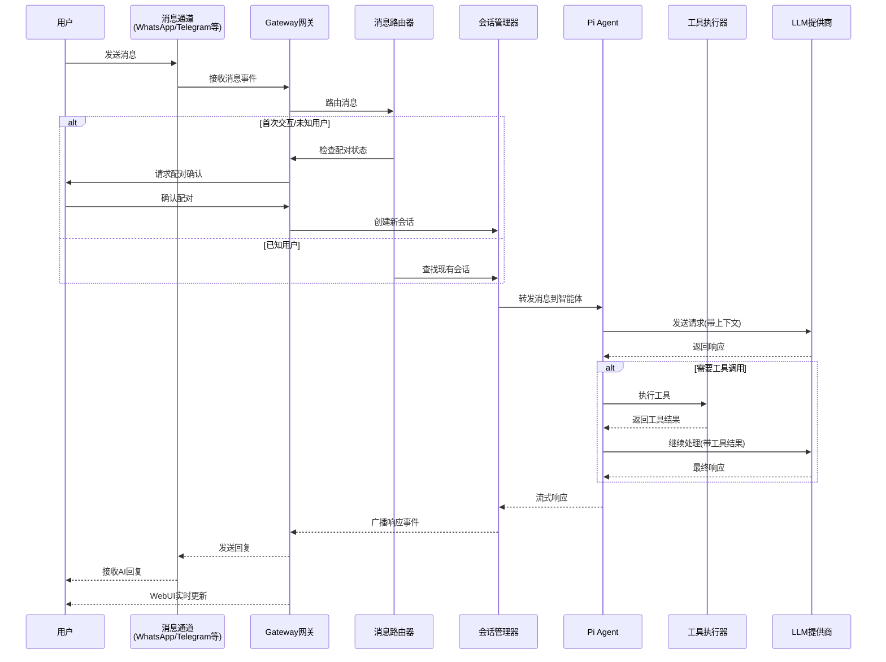
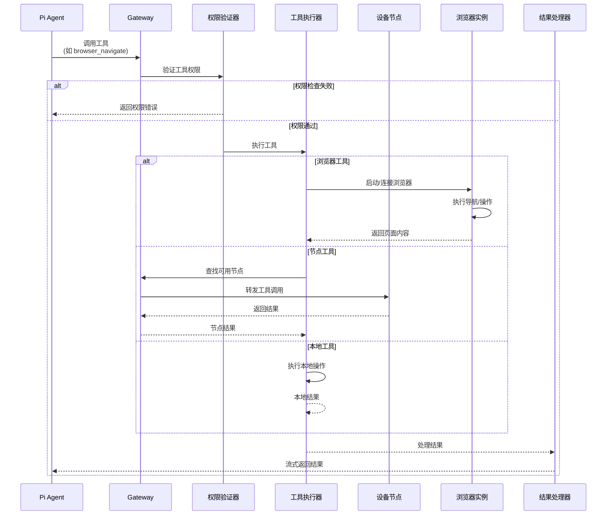
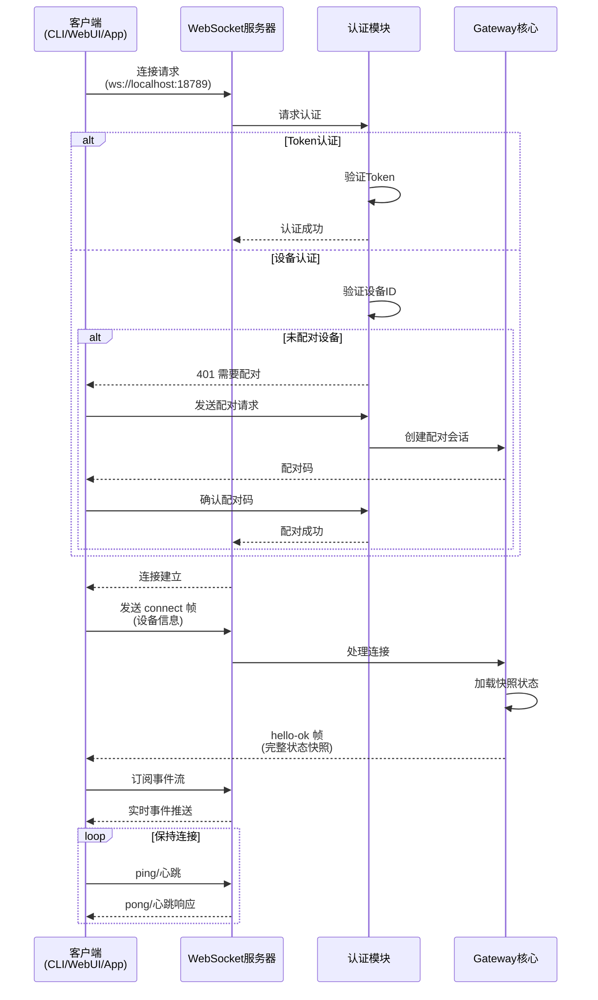
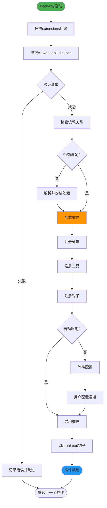
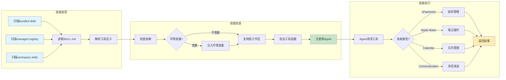

# Moltbot 业务流程图

## 一、消息处理主流程



**流程说明：**

1. **消息接收**: 用户通过任何配置的消息通道发送消息
2. **路由检查**: Gateway检查用户是否已配对（防止未授权访问）
3. **会话管理**: 查找或创建会话，维护对话上下文
4. **AI处理**: 消息发送到Pi Agent，携带历史上下文
5. **工具调用**: 如需要，Agent调用工具获取额外信息
6. **响应返回**: AI响应流式返回，同时更新所有连接的客户端
7. **多端同步**: WebUI、移动应用等实时显示对话

## 二、工具执行流程



**工具类型说明：**

- **浏览器工具**: 使用Playwright控制Chrome/Chromium，支持导航、输入、截图等
- **节点工具**: 调用macOS/iOS/Android设备的能力（相机、麦克风、传感器等）
- **本地工具**: 文件操作、系统命令、会话管理等
- **画布工具**: Agent创建和操作HTML画布界面

## 三、客户端连接与认证流程



**认证方式：**

1. **Token认证**: 使用配置的访问令牌
2. **设备认证**: 设备ID+配对码机制（适用于移动应用）
3. **本地认证**: 本地网络内的可信设备

**认证后功能：**

- 发送消息到Agent
- 控制通道（启用/禁用）
- 管理会话
- 查看日志和状态
- 接收实时事件推送

## 四、会话管理流程

```mermaid
stateDiagram-v2
    [*] --> 未配对: 新用户首次消息

    未配对 --> 配对中: 发送配对请求
    配对中 --> 已配对: 确认配对码
    配对中 --> 未配对: 配对超时/拒绝

    已配对 --> 会话创建: 首次对话
    会话创建 --> 活跃会话: 会话初始化完成

    活跃会话 --> 处理中: 接收新消息
    处理中 --> 活跃会话: 响应完成
    处理中 --> 工具执行: 需要工具
    工具执行 --> 处理中: 工具结果返回

    活跃会话 --> 暂停: 用户停止/超时
    暂停 --> 活跃会话: 用户恢复对话
    暂停 --> 已归档: 超过保留期

    活跃会话 --> 已归档: 手动归档
    已归档 --> [*]

    note right of 处理中
        上下文管理:
        - 消息历史
        - 工具调用记录
        - 向量记忆检索
    endnote

    note right of 工具执行
        工具类型:
        - 浏览器控制
        - 画布渲染
        - 设备节点
        - 会话操作
    endnote
```

**会话特性：**

- **上下文保持**: 维护完整对话历史
- **记忆集成**: 自动检索相关向量记忆
- **多轮对话**: 支持连续的复杂任务
- **状态持久化**: 会话状态持久化到磁盘
- **自动清理**: 超期会话自动归档

## 五、插件加载与扩展流程



**插件系统特点：**

- **自动发现**: 启动时自动扫描和加载
- **清单驱动**: 通过JSON清单定义能力
- **依赖管理**: 自动解析和安装依赖
- **生命周期钩子**: onLoad/onUnload/onConfigChange
- **故障隔离**: 单个插件失败不影响系统

## 六、技能(Skills)安装与执行流程



**技能类型：**

1. **Bundled Skills**: 随核心分发的技能
2. **Managed Skills**: 从ClawdHub注册表安装
3. **Workspace Skills**: 用户自定义的工作区技能

**技能示例：**

- **1Password**: 密码查询和条目管理
- **Apple Notes**: 创建和搜索笔记
- **Calendar**: 日历事件管理
- **Reminders**: 提醒事项操作
- **Communication**: 发送消息到各种平台

## 七、关键业务场景

### 场景1: 新用户首次交互

```
1. 用户在WhatsApp发送"Hello"
2. Gateway收到消息，发现未配对用户
3. 返回配对请求，要求用户确认
4. 用户确认配对（WebUI或命令行）
5. Gateway创建新会话
6. 欢迎消息发送到用户
7. Agent开始响应"Hello"
```

### 场景2: 复杂任务处理

```
1. 用户: "帮我查一下明天的天气并添加到日历"
2. Agent识别需要两个工具: web_search和calendar_create
3. 执行web_search获取天气信息
4. 使用天气信息调用calendar_create
5. 返回确认消息给用户
6. 所有步骤的上下文被保存到会话历史
```

### 场景3: 浏览器自动化

```
1. 用户: "打开亚马逊搜索耳机并截图"
2. Agent调用browser_navigate打开amazon.com
3. 调用browser_type输入搜索词
4. 调用browser_screenshot截取页面
5. 将截图发送给用户
6. 询问是否需要进一步操作
```

### 场景4: 多设备协作

```
1. 用户在iPhone上语音输入
2. 消息发送到Gateway
3. Agent决定需要使用Mac的浏览器
4. 调用Mac节点执行浏览器操作
5. 结果返回到iPhone显示
6. 同时在Mac的WebUI上显示操作记录
```

## 八、错误处理和恢复

### 消息发送失败
- 重试机制（最多3次）
- 降级到其他可用通道
- 记录错误日志
- 通知用户

### 工具执行失败
- 捕获错误并返回给Agent
- Agent尝试替代方案
- 失败信息记录到会话
- 用户可手动干预

### 网络断开
- 客户端自动重连
- 会话状态保持
- 未发送消息队列
- 恢复后重放

### Agent超时
- 设置合理超时时间
- 保存部分结果
- 提供重试选项
- 降级到简单响应
